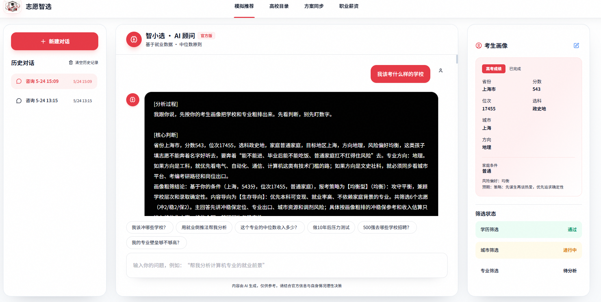
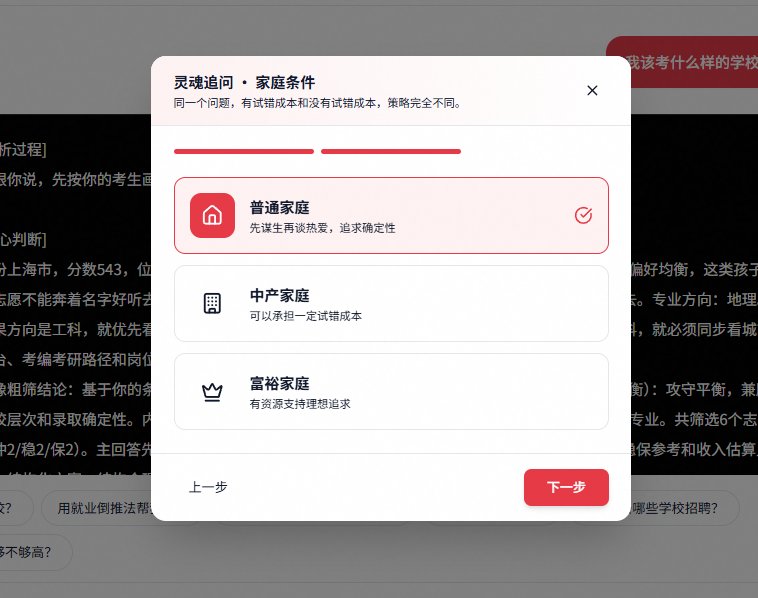
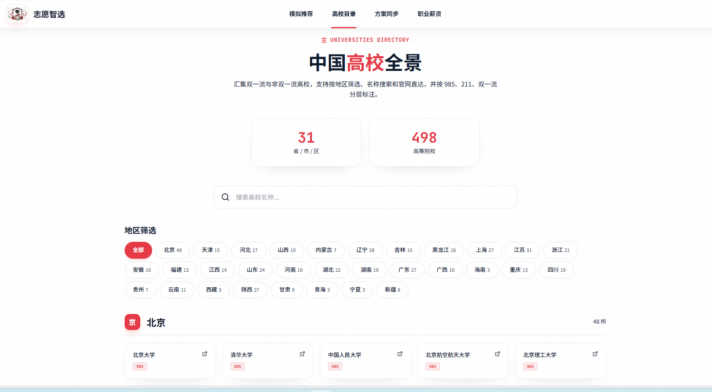
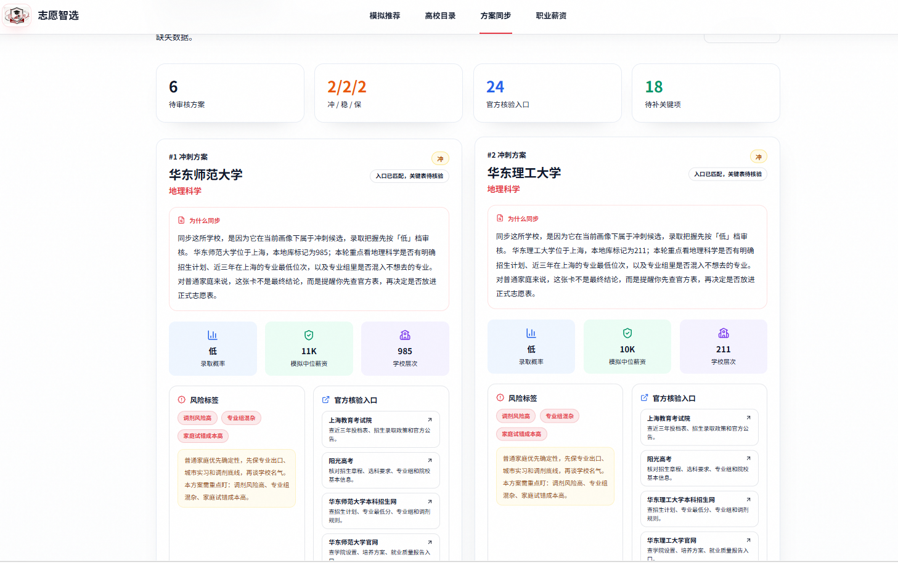
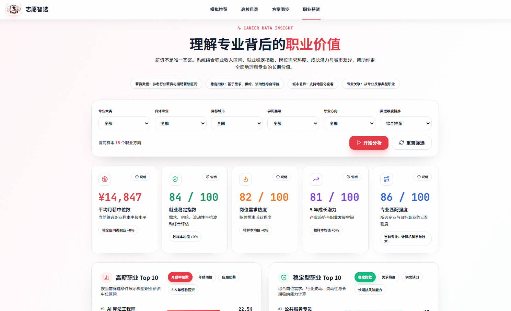
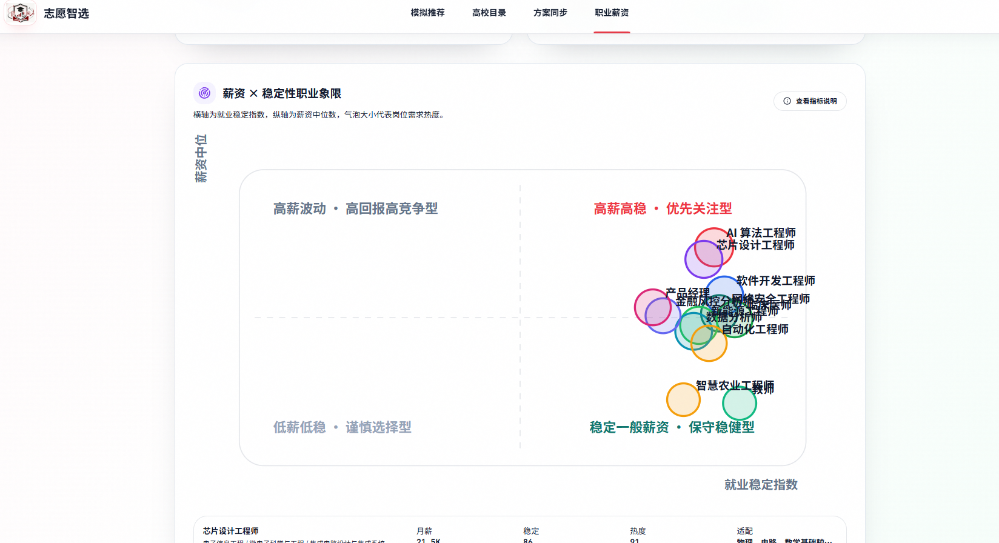
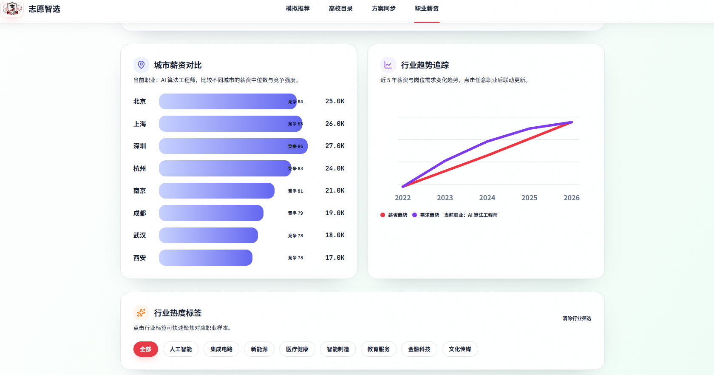
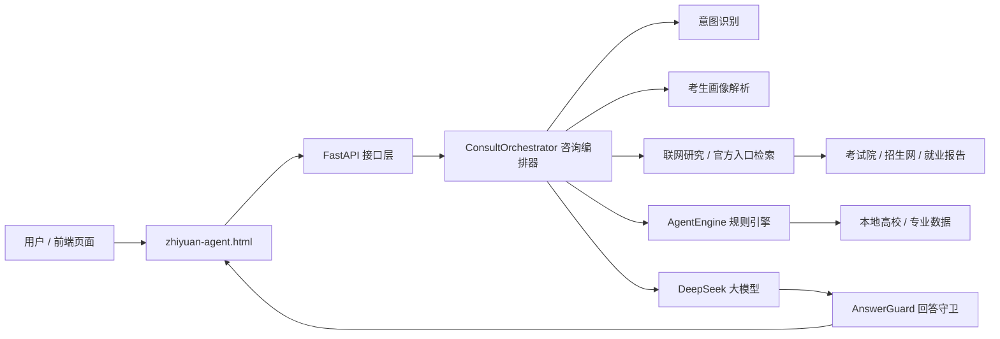

# 志愿智选：AI 高考志愿咨询与职业洞察系统


志愿智选是一款面向高考志愿填报场景的智能决策辅助系统。项目基于考生画像、院校专业数据、志愿推荐规则、职业就业指标和大模型咨询能力，帮助考生与家长完成从“我能上什么学校”到“这个专业十年后值不值得”的综合判断。

系统围绕截图中的四个核心页面展开：**模拟推荐、 高校目录、方案同步、职业洞察**。用户可以在 AI 顾问中输入问题，也可以通过考生画像向导补充省份、分数、位次、选科、家庭条件、风险偏好等信息，系统再结合本地数据、规则引擎和 DeepSeek 大模型给出志愿分析、风险提醒、官方核验路径和职业价值判断。

> 重要说明：本项目是高考志愿辅助决策工具，不替代省教育考试院、阳光高考、学校本科招生网、招生章程和就业质量报告。系统中的薪资、就业率、录取概率、不可替代性等指标包含本地估算和规则模拟，只能作为方向判断和排序参考。

## 一、项目作用

高考志愿填报不是简单地按分数选学校，而是要同时考虑：

- 分数、位次和省份批次规则
- 选科限制和专业组风险
- 学校层次、城市资源和行业背景
- 专业就业出口、薪资中位数和长期成长性
- 家庭条件、试错成本和风险承受能力
- 是否接受读研、考编、转行或长期培养周期

本项目的作用是把这些分散的信息整合到一个交互式系统中，让用户可以用自然语言提问，也可以通过可视化页面查看高校、审核方案和分析职业价值。它不仅给出“推荐什么”，还会解释“为什么推荐、风险在哪里、下一步该查什么官方资料”。

## 二、核心功能

### 1. 模拟推荐：AI 志愿顾问

截图中的主页面是 AI 咨询界面，采用三栏布局：

- 左侧：历史对话列表，可新建咨询
- 中间：AI 顾问对话区，支持快捷问题和自由输入
- 右侧：考生画像卡片，展示省份、分数、位次、选科、城市、专业方向和筛选状态

AI 顾问支持的问题包括：

- “我该冲哪些学校？”
- “用就业倒推法帮我分析”
- “这个专业的中位数收入多少？”
- “做 10 年后压力测试”
- “500 强去哪些学校招聘？”
- “我的专业壁垒够不够高？”

系统会根据用户当前画像自动判断问题类型，避免把薪资、中位数、500 强招聘、压力测试等事实类问题错误地改成院校推荐。

### 2. 考生画像向导

截图中的弹窗展示了多步骤画像采集流程：

1. **基本信息**
   - 省份
   - 高考分数
   - 位次排名
   - 选科组合

2. **家庭条件**
   - 普通家庭
   - 中产家庭
   - 富裕家庭

3. **意向确认**
   - 意向城市
   - 兴趣方向
   - 风险偏好：稳妥、均衡、激进

画像信息会影响推荐策略。例如普通家庭更强调就业确定性、专业壁垒和保底方案；风险偏好稳妥时，系统会更重视保底和滑档风险；目标城市明确时，系统会优先核验对应城市或省份的学校。

### 3. 高校目录：中国高校全景

高校目录页面展示全国高校数据，支持：

- 全国高校总览
- 省份/地区筛选
- 高校名称搜索
- 985、211、双一流等层次标签
- 省市维度展示高校卡片

截图中展示了：

- 31 个省/市/区
- 498 所高校
- 地区筛选按钮
- 北京等地区高校列表

该模块用于帮助用户先了解全国高校分布，再结合推荐方案做进一步筛选。

### 4. 方案同步：志愿审核台

方案同步页面是项目中非常重要的风险复核模块。它不是简单展示推荐结果，而是对每个志愿方案进行审核。

截图中可以看到：

- 待审核方案数量
- 冲/稳/保比例
- 官方核验入口数量
- 待补充资料数量
- 每个学校-专业方案的风险卡片

每张方案卡包含：

- 推荐学校和专业方向
- 冲稳保档位
- 推荐理由
- 薪资中位数参考
- 学校层次或标签
- 风险标签
- 官方核验入口
- 需要核验的数据表
- 缺失数据提醒
- 家庭风险策略

系统会提醒用户不要只看学校名气，还要核查：

- 省教育考试院近三年投档位次
- 学校本科招生网招生计划
- 专业组包含专业
- 选科要求
- 调剂规则
- 学院就业去向
- 学校就业质量报告

### 5. 职业洞察：理解专业背后的职业价值

职业洞察页面围绕“专业背后的就业价值”展开。它将专业从单纯的名称变成可比较的职业数据。

截图中展示的指标包括：

- 平均月薪中位数
- 就业稳定指数
- 岗位需求热度
- 5 年成长潜力
- 专业匹配强度

职业洞察还包含：

- 高薪职业 Top 10
- 稳定型职业 Top 10
- 薪资与稳定性职业象限图
- 专业相关职业网络
- 城市薪资对比
- 行业趋势曲线

用户可以选择某个专业，例如“计算机科学与技术”，查看相关岗位，如 AI 算法工程师、软件开发工程师、网络安全工程师、数据分析师、产品经理等，并比较不同城市的薪资水平和行业趋势。

## 界面预览

以下截图来自当前项目页面，用于展示主要功能和交互效果。















## 三、技术方法

### 前端技术

前端采用原生 Web 技术实现：

- HTML
- CSS
- JavaScript
- 单文件前端应用：`zhiyuan-agent.html`
- 通过 `fetch` 请求后端 API
- 无需 React、Vue、Vite 等构建工具

前端承担的职责包括：

- AI 对话交互
- 考生画像弹窗
- 历史会话展示
- 高校目录检索
- 志愿审核台展示
- 职业洞察可视化
- 推荐方案同步展示

### 后端技术

后端采用 Python Web 服务架构：

- FastAPI：API 服务框架
- Uvicorn：ASGI 服务启动器
- Pydantic v2：请求和响应数据建模
- pydantic-settings：读取 `.env` 配置
- DeepSeek API：大模型咨询能力
- Anthropic API：可选备用模型接入
- 本地 JSON 数据库：高校、专业、招生网入口等数据
- 自定义规则引擎：志愿推荐、风险评估、压力测试
- 中间件：日志、错误处理、限流、CORS

### AI 与规则方法

项目不是单纯调用大模型，而是将大模型与规则系统结合：

1. **意图识别**
   - 判断用户是在问推荐、单校机会、专业洞察、薪资中位数、500 强招聘还是压力测试。

2. **考生画像建模**
   - 使用省份、分数、位次、选科、家庭、城市、专业方向和风险偏好构建用户画像。

3. **规则推荐引擎**
   - 根据学校层次、专业属性、分数位次、城市偏好和风险偏好生成冲稳保方案。

4. **数据洞察**
   - 根据专业库、学校库和本地规则生成薪资、就业稳定性、不可替代性、岗位热度等分析。

5. **联网检索与官方核验**
   - 对招生网、省考试院、就业质量报告等公开来源进行检索，并在回答中提示数据边界。

6. **Prompt Engineering**
   - 通过系统提示词约束大模型回答风格、事实边界、推荐范围和数据表达方式。

7. **回答守卫机制**
   - 防止模型乱推荐学校、暴露内部技术词、把估算值说成官方数据、把事实问题跑偏成志愿推荐。

8. **张雪峰式志愿咨询 Skill**
   - 项目引入“张雪峰式志愿咨询 Skill”的分析思路，将家庭条件、就业出口、专业壁垒、城市资源、学历路径、普通家庭试错成本等因素纳入回答框架，使系统回答更接近真实志愿咨询场景。

## 四、系统架构



当前项目属于“单编排器 + 多 Agent 能力模块”的轻量级智能体架构，不是多个智能体互相对话的复杂多智能体框架，但已经具备多个 Agent 化能力：

- 推荐 Agent：生成冲稳保志愿候选
- 对比 Agent：比较多个志愿方案
- 洞察 Agent：分析学校或专业价值
- 压力测试 Agent：模拟 10 年后专业风险
- 回答守卫 Agent：检查回答是否跑题、夸大或泄露技术词

## 五、项目目录

```text
.
├── api/
│   ├── agent.py                  # Agent 能力接口
│   ├── consult.py                # AI 咨询接口
│   ├── data.py                   # 高校、专业、语录等数据接口
│   ├── evaluate.py               # 决策评估接口
│   └── sessions.py               # 会话管理接口
├── core/
│   ├── agent_engine.py           # 推荐、洞察、对比、压力测试规则引擎
│   ├── answer_guard.py           # 回答守卫
│   ├── config.py                 # 配置读取
│   ├── consult_orchestrator.py   # 咨询主编排器
│   ├── family_risk.py            # 家庭风险策略
│   ├── llm_client.py             # DeepSeek / Anthropic 调用
│   ├── models.py                 # Pydantic 数据模型
│   ├── research_client.py        # 联网检索与来源摘要
│   ├── session_manager.py        # 内存会话管理
│   └── zxf_engine.py             # 决策评估与追问逻辑
├── data/
│   ├── majors.json               # 专业数据
│   ├── schools.json              # 高校数据
│   ├── school_admissions_urls.json # 学校招生网入口
│   └── quotes.json               # 表达语料
├── middleware/
│   ├── error_handler.py          # 统一异常处理
│   ├── logging.py                # 请求日志
│   └── rate_limit.py             # 简单限流
├── prompts/
│   └── system_prompt.txt         # 大模型系统提示词
├── tests/
│   └── test_consult_intent_contracts.py # 咨询意图与回答契约测试
├── assets/
│   └── brand-logo.png            # 项目 Logo
├── main.py                       # FastAPI 入口
├── requirements.txt              # Python 依赖
├── README.md                     # 项目说明
└── zhiyuan-agent.html            # 前端页面
```

## 六、快速开始

### 1. 安装依赖

```powershell
python -m venv .venv
.\.venv\Scripts\Activate.ps1
pip install -r requirements.txt
```

### 2. 配置 DeepSeek API

在项目根目录创建或修改 `.env`：

```env
LLM_PROVIDER=deepseek
DEEPSEEK_MODEL=deepseek-v4-pro
DEEPSEEK_API_KEY=你的 DeepSeek API Key
DEEPSEEK_BASE_URL=https://api.deepseek.com/chat/completions

LLM_TIMEOUT=40
RESEARCH_TIMEOUT=6
RATE_LIMIT_WINDOW=60
RATE_LIMIT_MAX=30
```

DeepSeek 配置读取位置：

- `core/config.py`
- `core/llm_client.py`

### 3. 启动后端

```powershell
python -m uvicorn main:app --host 127.0.0.1 --port 8000
```

健康检查：

```powershell
Invoke-RestMethod http://127.0.0.1:8000/health
```

### 4. 打开前端

直接用浏览器打开：

```text
zhiyuan-agent.html
```

前端默认调用：

```text
http://127.0.0.1:8000
```

## 七、主要接口

| 接口 | 方法 | 作用 |
| --- | --- | --- |
| `/health` | GET | 健康检查 |
| `/api/consult` | POST | AI 志愿咨询主接口 |
| `/api/consult/stream` | POST | 流式 AI 咨询 |
| `/api/agent/recommend` | POST | 智能志愿推荐 |
| `/api/agent/compare` | POST | 志愿方案对比 |
| `/api/agent/insights` | POST | 学校/专业洞察 |
| `/api/agent/pressure-test` | POST | 10 年后压力测试 |
| `/api/agent/analyze` | POST | 深度分析 |
| `/api/data/schools` | GET | 高校数据 |
| `/api/data/majors` | GET | 专业数据 |
| `/api/sessions` | GET/POST | 会话列表与创建 |

## 八、示例请求

```powershell
$body = @{
  question = "这个专业的中位数收入多少？"
  context = @{
    province = "上海"
    score = 543
    rank = 14299
    subjects = "物化生"
    family_background = "普通家庭"
    city_preference = @("上海")
    major_preference = @("物理学")
    risk_appetite = "稳妥"
  }
} | ConvertTo-Json -Depth 5

Invoke-RestMethod `
  -Uri http://127.0.0.1:8000/api/consult `
  -Method Post `
  -Body $body `
  -ContentType "application/json; charset=utf-8"
```

## 九、测试

运行核心测试：

```powershell
$env:PYTHONDONTWRITEBYTECODE='1'
python -m unittest -v tests.test_consult_intent_contracts
```

当前测试重点覆盖：

- 非推荐问题不应跑偏成院校推荐
- 单校问题不应扩展成多校列表
- 中位数、薪资、500 强、压力测试等问题保持原始意图
- 流式回答和最终回答一致
- 主回答不暴露 Agent、后端、提示词等内部技术词
- 推荐回答不泄露具体模拟概率和未核验薪资数字

## 十、数据可信边界

项目中的数据分为四类：

| 类型 | 说明 |
| --- | --- |
| 官方数据 | 省教育考试院、阳光高考、学校本科招生网、学校就业质量报告 |
| 公开来源 | 联网检索得到的公开网页，需要二次核验 |
| 本地估算 | 专业薪资、就业率、不可替代性、成长潜力等本地经验数据 |
| 规则模拟 | 冲稳保档位、录取概率、风险标签等规则引擎输出 |

系统会尽量在回答中说明数据性质，但正式填报仍必须以官方发布信息为准。

## 十一、项目特色

- 将 AI 咨询和志愿规则结合，不只是聊天机器人
- 将考生画像作为推荐和分析的核心输入
- 将普通家庭风险、城市资源、专业壁垒和就业出口纳入决策
- 将推荐结果同步到志愿审核台，强调官方核验和缺失数据
- 将专业选择延伸到职业价值和长期就业趋势
- 使用回答守卫机制降低 AI 幻觉和跑题风险
- 引入张雪峰式志愿咨询 Skill，使回答更贴近真实咨询场景

## 十二、后续优化方向

- 将 `consult_orchestrator.py` 拆分为意图识别、事实回答、推荐编排、压力测试和核验模块
- 为高校、专业、薪资、就业率等字段补充来源、更新时间和可信度等级
- 将会话从内存存储迁移到 SQLite 或 Redis
- 将限流从内存方案升级为 Redis 方案
- 增加更多官方来源优先检索逻辑
- 为志愿审核台补充导出报告功能
- 为职业洞察页增加更多专业和城市对比数据
- 增加端到端测试，覆盖前端交互、后端接口和流式回答

## 十三、项目声明

本项目用于高考志愿咨询辅助、课程设计、创新创业项目展示和决策支持研究。系统输出不能替代官方录取规则和招生政策，也不能保证录取结果。最终志愿填报应结合考生本人兴趣、家庭条件、官方数据、学校招生章程和专业发展规划综合判断。

## 十四、开源协议

本项目采用 **GNU Affero General Public License v3.0（AGPL-3.0）** 开源协议。完整协议文本见 [LICENSE](LICENSE)。

如果基于本项目进行修改、部署或通过网络提供服务，应遵守 AGPL-3.0 的源代码开放与协议传递要求。
